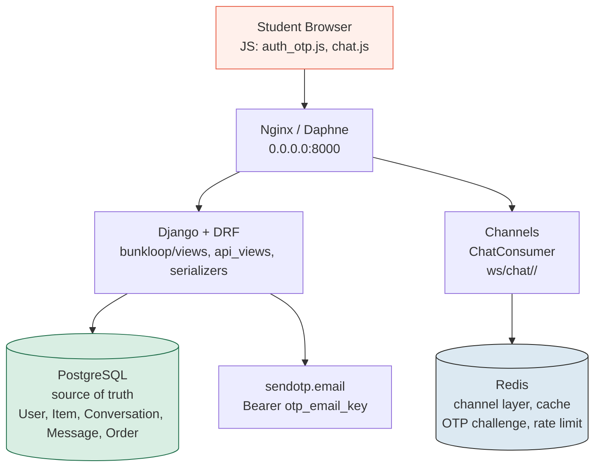
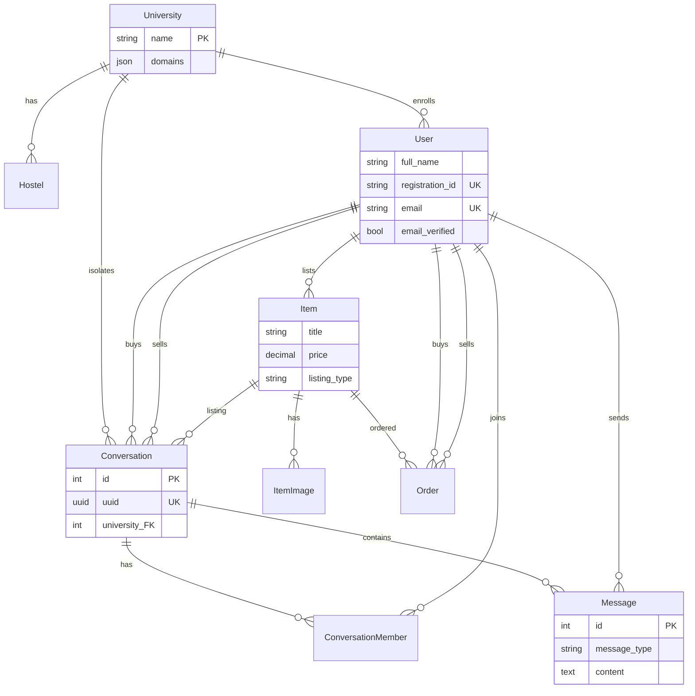
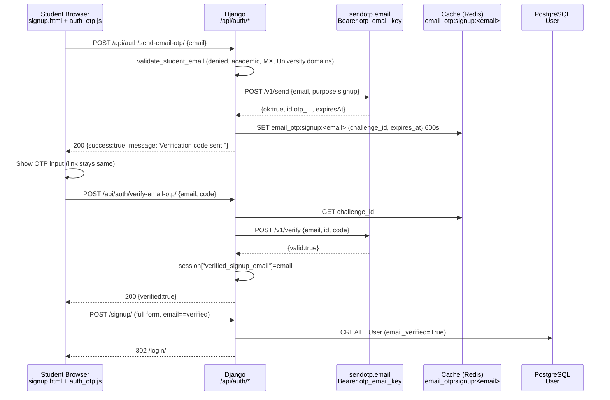
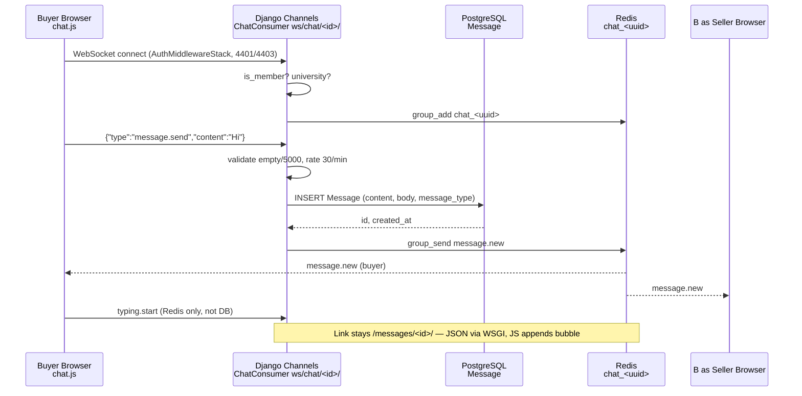
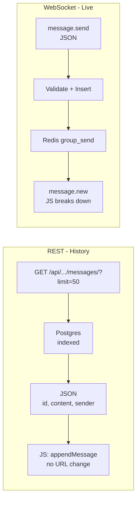
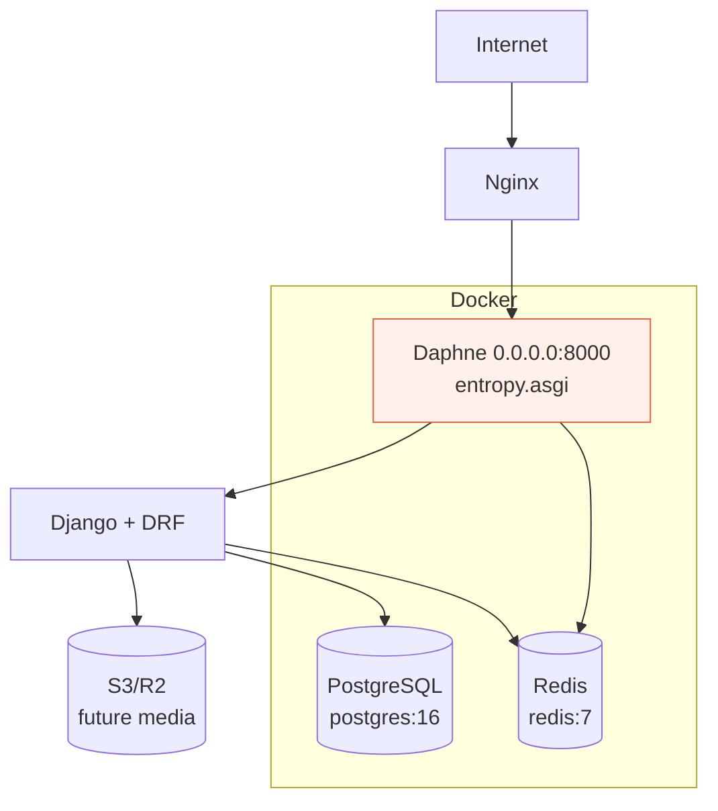

# Bunkloop Backend — Brief Overview (UTF-8)

> Django 5.2.17 + PostgreSQL (prod) / SQLite (dev) + Redis (Channels) + Daphne + DRF + WhiteNoise

> **PDF-ready with infographics** — all diagrams below use Mermaid (supported by GitHub, VS Code, md-to-pdf, etc.). Export this `.md` to PDF via `md-to-pdf`, `pandoc`, or VS Code “Markdown PDF”.



## 1. Project Layout
```
Entropy_temp/
├── entropy/                 # Django project (settings, urls, wsgi, asgi)
│   ├── settings.py          # 12-factor env-driven (DEBUG, SECRET_KEY, DB, REDIS, EMAIL, OTP, CHAT)
│   ├── urls.py              # /health/, /api/, /, /admin/
│   └── asgi.py              # ProtocolTypeRouter {http: Django, websocket: AuthMiddlewareStack(URLRouter(chat))}
├── bunkloop/                # Main app
│   ├── models.py            # University, ProfileImage, Hostel, User, Item, ItemImage, Conversation, ConversationMember, Message, Order
│   ├── forms.py             # UserProfileForm, ItemForm, validate_student_email (University.domains + .edu/.ac. + MX)
│   ├── views.py             # auth, home, item, conversation, order, university, health, terms
│   ├── services.py          # get_or_create_listing_conversation, create_message, mark_read, get_unread_count (atomic, university isolation)
│   ├── email_otp.py         # sendotp.email service (Bearer otp_email_key, never stored OTP, challenge_id in cache)
│   ├── auth_otp_views.py    # POST /api/auth/send-email-otp/, POST /verify-email-otp/ (cache challenge, session verified_signup_email)
│   ├── api_views.py         # DRF chat REST (CursorPagination -updated_at/-created_at)
│   ├── serializers.py       # Conversation/Message/Item brief
│   ├── consumers.py         # ChatConsumer (AuthMiddlewareStack, membership 4403, group chat_<uuid>, rate-limit 30/min, Redis)
│   ├── routing.py           # ws/chat/<id>/
│   ├── context_processors.py# nav_unread_count / nav_pending_orders
│   ├── admin.py             # University (domains_text), User, Item etc.
│   └── migrations/          # 0001_initial + 0007_ensure_identity + 0008_conversation/order + 0009_university_domains + 0010_seed + 0011_member/listing
├── templates/bunkloop/      # base, home, login, signup, verify_email, profile, item_*, conversations, orders, universities, terms, 404
├── static/css/ + js/        # app.css + per-page UTF-8 (pages/*.css/js), chat.js, auth_otp.js, cookie_banner.js
├── Dockerfile               # python:3.12-slim, daphne -b 0.0.0.0 -p 8000
├── docker-compose.yml       # postgres:16 + redis:7 + web (migrate + collectstatic + daphne)
└── manage.py, requirements.txt, .env.example
```

## 2. Core Models



- **University** `name, domains:JSONField[list]` — `is_domain_allowed()` (exact/subdomain), `get_domains_display()`, `clean()` normalizes.
- **User** `AbstractUser` + `full_name, registration_id (unique, to_field for Item), university(FK), profile_image, contact_number, student_type, hostel(FK), email(unique), gender, identity_photo, email_verified`. `clean()` enforces hosteler→hostel.
- **Item** `title, description, registration_id(FK User.to_field), category(FK), price, listing_type, condition, created_at`; **ItemImage** `item(FK), image` (max 4, `full_clean` in `save`).
- **Conversation** `uuid(UUID, null), university(FK), item(FK), listing(FK SET_NULL), buyer/seller(FK User), created/updated_at` (unique_together `item+buyer`); `save()` auto-fills `university/listing`.
- **ConversationMember** `conversation(FK), user(FK), last_read_message(FK Message), muted, joined_at` + `UniqueConstraint(conversation,user)`.
- **Message** `conversation(FK), sender(FK), body/content, message_type(TEXT/IMAGE/SYSTEM), media_url, created_at, edited_at, deleted_at, is_read` + indexes `(conversation,-created_at)`, `(sender,-created_at)`.
- **Order** `item(FK PROTECT), buyer/seller(FK), amount, listing_type, status(pending→paid→confirmed→shipped→delivered→completed/cancelled), payment_status, payment_reference, provider, timestamps`.

| Entity | Key Fields | Relations | Notes |
|---|---|---|---|
| University | `domains` JSON list | 1—N Hostel, User, Conversation | `thapar.edu` allowlist |
| User | `registration_id` unique | N—1 University | `to_field` for Item |
| Item | `price, listing_type` | N—1 Category, 1—N Images | Max 4 images |
| Conversation | `uuid, university` | N—1 Item, 1—N Members/Messages | `item+buyer` unique |
| Message | `content, message_type` | N—1 Conversation | Indexed |
| Order | `status, payment_status` | N—1 Item | `pending→completed` |

## 3. Auth & OTP



- **Signup** `UserProfileForm` validates `email` via `validate_student_email` (denied list env `ALLOWED_EMAIL_DENIED_DOMAINS`, academic suffixes `ALLOWED_ACADEMIC_SUFFIXES`, University `domains` allowlist, `dns MX`), `university.domains` strict check in `clean()`, `identity_photo` (Pillow).
- **OTP** `email_otp.py: send_email_otp() / verify_email_otp()` → `POST https://api.sendotp.email/v1/send|verify` with `Authorization: Bearer $otp_email_key` (never frontend, never logged). Fallback to local random `6`-digit (`OTP_LENGTH`) when `otp_email_key` missing or `test` in argv (fast, <10s tests). Challenge `{id}` stored in `cache` (`email_otp:signup:<email>`, 600s `OTP_TTL_SECONDS`, Redis or LocMem), **never OTP code**. Verification sets `session["verified_signup_email"]`; signup checks it before `User` creation (`email_verified=True`). Resend cooldown `429` handled.
- **API** `POST /api/auth/send-email-otp/ {email}` → `{success, expires_at, retry_after}`; `POST /verify-email-otp/ {email,code}` → `{verified, message}` + session.

| Step | WSGI Sends | JS Breaks Down | HTML Update |
|---|---|---|---|
| Send | `200 {success:true}` | `data.message` → `setStatus` | `Verify` input shown, no URL change |
| Verify | `200 {verified:true}` | `data.verified` → `emailInput.readOnly=true` | `Complete registration` enabled |
| Fail | `400 {error, reason}` | `data.reason` → `wrong_code` mapping | Inline `form-errors` |

## 4. Views & URLs
- `require_login` (session `user_registration_id`) guards `profile, home, my_items, item_create, item_detail, item_delete, conversation_*, order_*, university_list`.
- `login_view`/`signup` redirect `GET` when already authed (`signup` allows no-university to complete profile, breaks loop), `POST` flushes for account switch (tests). `verify_email` handles both `OTP_STORE` (fallback) and `cache` (`sendotp`).
- `home` filters `Q(title|description|category__name icontains q)` + `category`, annotates `nav_unread_count/nav_pending_orders`; `item_delete` (owner only, `orders.exists()` → `PROTECT` error).
- `conversation_list/detail, start_conversation` use `services` (atomic, university isolation, `ConversationMember` auto-create). `order_create` mock `succeeded` + `MOCK-{pk}-…`, `order_update_status` role-restricted transitions.
- `health_check` (`/health/`) `SELECT 1` → `{"status":"ok"}`.
- `terms_view` (`/terms/`, `/tnd/`), `university_list`, `custom_404` (`handler404`).

## 5. Messaging (Real-time)



- **REST** `/api/chat/conversations/ (POST {listing_id})`, `GET /api/chat/conversations/`, `GET /api/chat/conversations/<uuid|pk>/`, `GET .../messages/?limit=50&before=<id>`, `POST .../read/` — DRF `SessionAuthentication`, `IsAuthenticated`, `CursorPagination` (`-updated_at/-created_at`), university isolation via services.
- **WebSocket** `ws/chat/<id>/` `ChatConsumer` (`AuthMiddlewareStack`, membership `4403`, university check, `group_add f"chat_{uuid|pk}"`, `receive` `message.send` → `validate (empty/5000) → rate limit 30/min via cache → create_message → group_send message.new`, `typing` relay, `message.read`). Frontend `chat.js` fetches history via `GET .../messages/` (WSI JSON, JS breaks down, no `pushState` — link stays `/messages/<id>/`), sends via `WS` (fallback `POST .../messages/` via `fetch`), dedup by `data-message-id`, reconnect backoff 1/2/4/8s.
- **Services** keep consumer thin; `transaction.atomic()` prevents duplicate conversations.



## 6. Settings & Env (12-factor, no hard-code)
- `SECRET_KEY` fail-closed when `!DEBUG`, `ALLOWED_HOSTS` `*` in `DEBUG` + dynamic LAN IP via `8.8.8.8` trick (env `LAN_DISCOVERY_IP`), `CSRF_TRUSTED_ORIGINS` env, `TIME_ZONE='Asia/Kolkata'` (was `UTC`), `USE_TZ=True`.
- `DB` `DB_ENGINE/NAME/USER/PASSWORD/HOST/PORT` → `postgres` (prod) / `sqlite` (dev) + `TEST` `test_bunkloop_db`/` :memory:`; `REDIS_HOST/PORT/URL` → `channels_redis` (Docker `redis`, dev `127.0.0.1` → `InMemory` if no Redis/test), `CACHES` `RedisCache`/`LocMem`.
- `EMAIL_BACKEND` `console` (dev) / SMTP env, `DEFAULT_FROM_EMAIL` env, `OTP_*`, `CHAT_*`, `ALLOWED_EMAIL_*` all env-driven with safe defaults.
- `STATIC_URL/MEDIA_URL`, `WhiteNoise`, `daphne` in `INSTALLED_APPS` first, `ASGI_APPLICATION`.

## 7. Frontend
- `base.html` (`meta charset utf-8`, `topbar` with Messages/Orders badges via `context_processors`, `progress-bar` + `cookie-banner` (`localStorage` Accept → 1yr, Ask later → session, only on `/`)).
- `home.html` toolbar `GET ?q=&category=` (preserves `q`), `filter-chips` `overflow-x:auto` hidden bar but scroll, `listing-grid` responsive 3→2→1.
- `item_detail.html` (Contact Seller card + `Message Seller`/`Buy` only for non-owner, `Remove` for owner).
- `conversation_detail.html` (chat-card, status, `Load older` via JS `?before` without URL change).

## 8. Docker & Deploy



- `Dockerfile` `python:3.12-slim` `pip install -r requirements.txt` `collectstatic` `CMD ["daphne","-b","0.0.0.0","-p","8000","entropy.asgi:application"]` `HEALTHCHECK /health/`.
- `docker-compose.yml` `postgres:16-alpine` + `redis:7-alpine` + `web` (`depends_on healthy`, `env_file/.env` `otp_email_key`, `REDIS_HOST=redis`, `DB_HOST=db`, `daphne`).
- Run: `python manage.py runserver 0.0.0.0:8000` (or `docker compose up --build`), peer at `http://192.168.137.36:8000/` (or `LAN_IP:8000`), health `curl http://.../health/`.

| Service | Image | Env Must |
|---|---|---|
| `web` | `bunkloop` (Daphne) | `DJANGO_SECRET_KEY`, `DB_PASSWORD`, `otp_email_key` |
| `db` | `postgres:16-alpine` | `DB_PASSWORD` |
| `redis` | `redis:7-alpine` | — |
```

## 9. Tests
- `bunkloop/tests.py` 9 tests: profile, item limits, routes, signup reject gmail, signup OTP → verify (fallback), messaging start/isolated, order lifecycle `pending→paid→confirmed→shipped→delivered→completed`, health.
- OTP mocked via `patch('bunkloop.email_otp.requests.post')` or `test` fallback (no network), `chat` mocked not needed (InMemory).
- Run: `python manage.py test bunkloop.tests` or `USE_INMEMORY_CHANNEL_LAYER=1`.

— Brief end —
